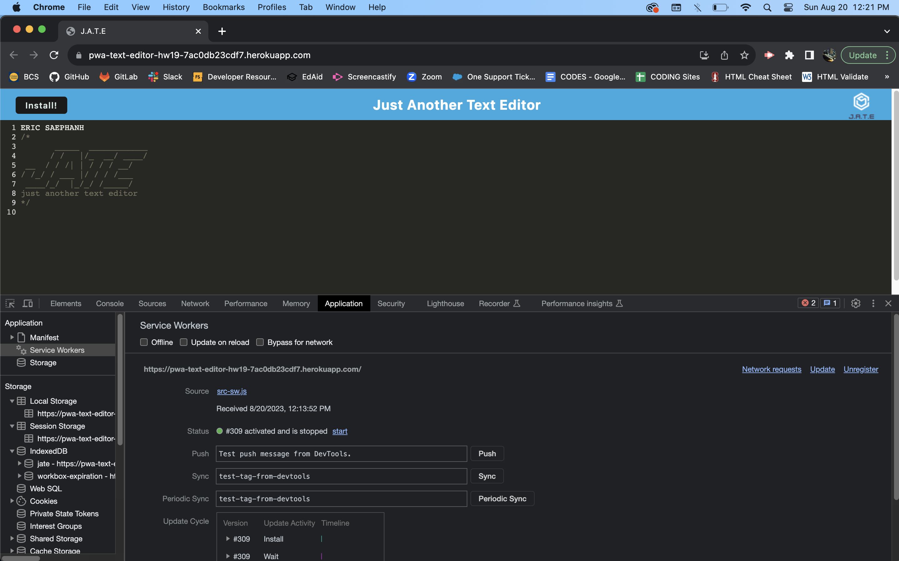

# pwa-text-editor
homework challenge 19

## Description
AS A developer I WANT to create notes or code snippets with or without an internet connection
SO THAT I can reliably retrieve them for later use

- The application works without an internet connection. 
- Uses IndexedDB to create an object store and includes both GET and PUT methods
- Bundled with webpack
- Create a service worker with workbox that Caches static assets

## Installation
Git clone the repo to run this locally. Open the CLI and go to the correct directory. Next enter npm i to install the required packages. Then go into the client folder and enter npm run build to create the dist folder. After that, cd out to the root directory and enter npm run dev to start the app.  

Once the app is running, you can click the install button in the top left. Once installed, you can use without internet connection locally. 

## Usage
This PWA text editor is used create notes or code snippets. 

## License
ISC

## Links

Github Repo: https://github.com/saephanhe56/pwa-text-editor  
Deployed Link: https://pwa-text-editor-hw19-7ac0db23cdf7.herokuapp.com/

## Mockup Example Product 
